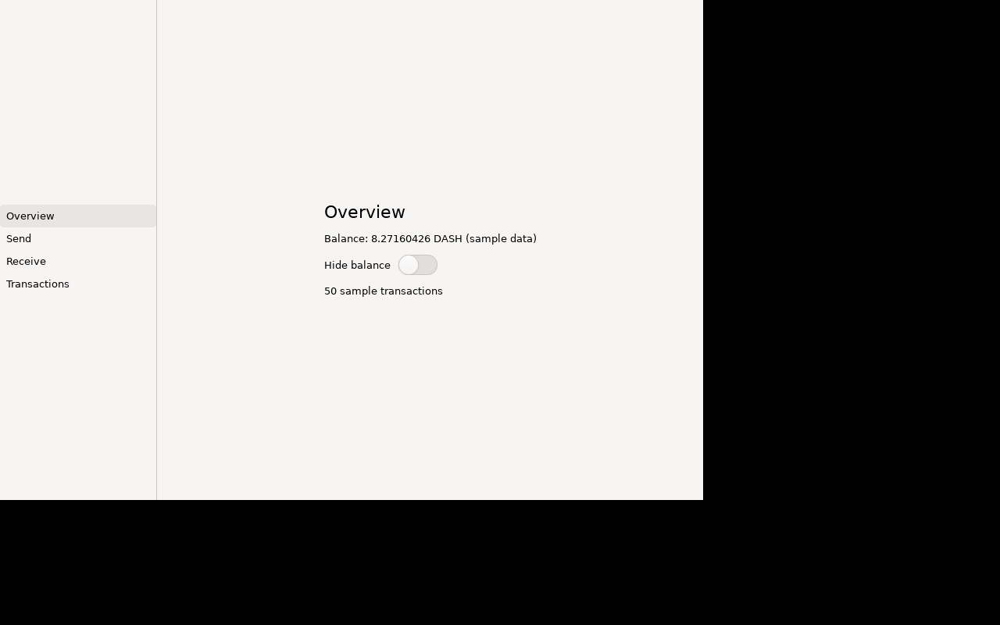
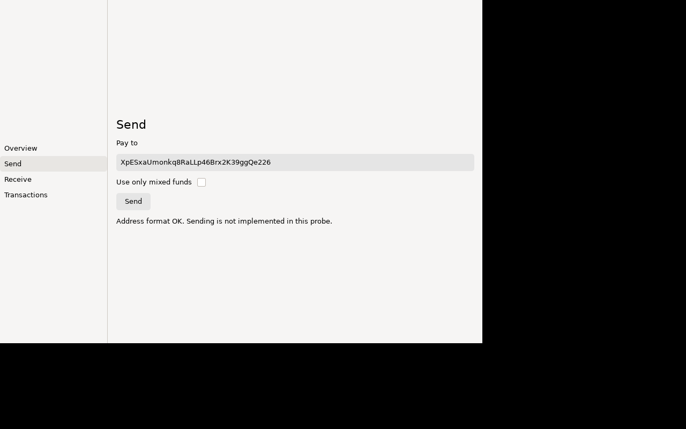
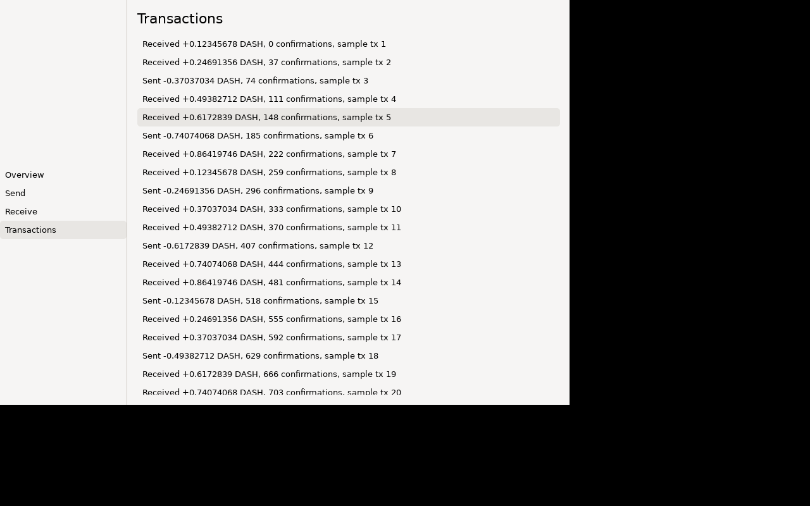

# G2 probe results — SwiftCrossUI 0.10.0 GtkBackend on Linux

Run date: 2026-10-05. Host: Apple Silicon Mac, OrbStack Docker. Image `dwd-linux-swift-gtk`
(`ci/linux/Dockerfile.swift-gtk`): `swift:6.3.3-noble` (Ubuntu 24.04) + GTK **4.14.5** + Xvfb +
dbus + at-spi2-core + python3-pyatspi/dogtail. Decision record: `docs/adr/0002-crossui-linux-gate.md`.

**Summary:** the probe builds and its tests pass on aarch64 (native) and x86_64 (Rosetta). Under
Xvfb with a D-Bus session and the AT-SPI bus, a Python script drives the whole app through AT-SPI only:
it switches sidebar pages, flips the switch, types an address, presses Send, sees the view model's
reply, and selects a transaction. Result: **24 checks (16 hard, 7 soft, 1 info): 0 hard failures, 6 accessibility gaps**, the
same on both architectures, and stable over 4 runs. One crash was found and has a workaround: an
unscrolled `List` of 34 or more rows makes the window taller than X11's limit (see "Crashes").

## What the probe is

`probes/crossui-linux` is a standalone SwiftPM package. It does not touch the root `Package.swift`.

| Target | Contents |
|---|---|
| `WalletProbeCore` | `@MainActor @Observable final class WalletProbeViewModel` that imports only Foundation and Observation. It holds the sidebar selection, 50 deterministic sample transactions, the address field, a Send action, hide-balance and mixed-funds toggles, and integer-only DASH formatting. Send only checks the address format and then reports `.notImplemented`. It never fakes success. |
| `CrossUILinuxProbe` | SwiftCrossUI 0.10.0 + `GtkBackend`. Contains a `NavigationSplitView` with a sidebar `List` (Overview/Send/Receive/Transactions). Overview has the balance and a `Toggle` (`.switch`). Send has a `TextField`, a `Toggle` (`.checkbox`), a `Button("Send")` and a status label. Transactions has a `List` of 50 rows inside a `ScrollView`. |
| `WalletProbeCoreTests` | Swift Testing, headless: 13 tests (23 cases with the parameterised ones). Covers the initial state, sidebar order, sample-data determinism, balance, hide-balance, amount formatting (incl. `Int64.min`), the address format check, Send phases, and `withObservationTracking` change notification. |

Scripts (all in `probes/crossui-linux/scripts/`):
- `run-in-container.sh [OUT_DIR] [--platform linux/amd64]`: the host entry point. It runs the two scripts below in the image. SwiftPM `.build` lives in the named volume `dwd-crossui-probe-build-<arch>`.
- `container-build-test.sh`: `swift build`, `swift test`, binary size, `ldd`.
- `container-a11y-smoke.sh`: `dbus-run-session` → Xvfb `:99` 1280x800x24 → `at-spi-bus-launcher` → launches the probe → `atspi_smoke.py` → checks whether the app is still alive.
- `atspi_smoke.py`: finds the app by PID on the AT-SPI bus, dumps the tree (role, name, states, actions, attributes, extents) and takes an Xvfb screenshot at each step. Hard checks set the exit code. Soft checks record gaps.

Reproduce: `docker build -f ci/linux/Dockerfile.swift-gtk -t dwd-linux-swift-gtk ci/linux && probes/crossui-linux/scripts/run-in-container.sh`
(run outside the Claude sandbox). Artifacts go to `scratch/crossui-linux-<arch>/`. A copy of the
aarch64 run used for this report is in `probes/crossui-linux/evidence/`.

## Build and test times

| Step | aarch64 (native) | x86_64 (`--platform linux/amd64`, Rosetta) |
|---|---|---|
| Image build (`docker build`, apt layer) | 305 s first build; 137 s rebuild (base image cached) | 250 s (base pull 95 s + apt 148 s) |
| `swift build` (debug), cold, empty `.build` incl. git fetch of 23 packages | 232.6 s | attempt 1: **failed** after 100 s (see below); attempt 2: 454.3 s |
| `swift build` (debug), cold compile, checkouts already resolved | 92.2 s | — |
| `swift build` (debug), incremental after an app-file edit | 21–33 s | 69 s |
| `swift test` (builds test target + runs) | 10–35 s; tests themselves 0.003–0.006 s | 13.7–22.3 s build; tests 0.06 s |
| `swift build -c release --product CrossUILinuxProbe` (cold release in the debug volume) | 549.1 s | not run |

The first x86_64 attempt failed with
`error: failed parsing the Swift compiler output: unexpected JSON message`, and SwiftPM also logged
`encountered an I/O error (code: 4)` (EINTR) while reading a repository cache. The retry with no
changes succeeded. This looks like a Rosetta emulation flake, not a code problem. CI should run
x86_64 on native runners, or retry once when emulated.

Build-log noise (harmless): 4× `you may be able to install gtk+-3.0` (the Gtk3 backend's
system-library hint) and 4× `prohibited flag(s): -pthread` (SwiftPM drops `-pthread` from
gtk4's pkg-config flags).

## Binary size and runtime

| | aarch64 | x86_64 |
|---|---|---|
| Debug binary | 35,475,824 B (35.5 MB) | 35,381,584 B (35.4 MB) |
| Debug, stripped | 18,560,528 B (18.6 MB) | 19,316,648 B (19.3 MB) |
| Release binary | 26,056,904 B (26.1 MB) | — |
| Release, stripped | 6,304,664 B (6.3 MB) | — |
| Shared libraries (`ldd`) | 83: GTK 4 stack + dynamic Swift runtime (`libswiftCore`, `libswiftObservation`, `libswift_Concurrency`, `libswiftSynchronization`, …) | 83 |
| Time to appear on the AT-SPI bus | 1.5–2.2 s | 3.8 s |
| RSS at end of smoke run (debug) | 262–299 MB | 378–379 MB |

Dynamic Swift runtime means the portable tarball needs `--static-swift-stdlib` (as DESIGN §3.4
plans) or bundled `.so` files. RSS is a debug build on Mesa llvmpipe (GTK uses GL; `libEGL
warning: DRI3 error` under Xvfb is expected), so it is not a product number. Re-measure on a
release build with a real GPU.

## AT-SPI checks (final run, identical on aarch64 and x86_64)

| # | Kind | Check | Result |
|---|---|---|---|
| 1 | hard | probe registered on the AT-SPI bus (found by PID) | PASS |
| 2 | hard | window exposed as `frame` named "Dash Wallet Probe" | PASS |
| 3 | hard | sidebar `list` exposes 4 `list item`s Overview/Send/Receive/Transactions (text from child labels) | PASS |
| 4 | soft | sidebar list items carry their **own** accessible name | **GAP**: names are `""`; text is only on the child `label` |
| 5 | hard | switch-style toggle exposed (GTK 4.14 reports `GtkSwitch` as role `check box`, action `toggle`) | PASS |
| 6 | soft | switch named "Hide balance" | **GAP**: name `""`; "Hide balance" is a sibling `label`, not associated |
| 7 | hard | toggle the switch through AT-SPI `Action`; balance label changes to "Balance: hidden" | PASS |
| 8 | hard | select sidebar "Send" through AT-SPI `Selection` | PASS |
| 9 | hard | button exposed as `push button` named "Send", action `click` | PASS |
| 10 | hard | text field exposed as an editable `text` (Text + EditableText interfaces) | PASS |
| 11 | soft | text field has an accessible name | **GAP**: name `""`; the "Pay to" label is not associated |
| 12 | soft | text field exposes its placeholder | PASS: attribute `placeholder-text:Dash address` |
| 13 | hard | checkbox-style toggle exposed as `check box` | PASS |
| 14 | soft | checkbox named "Use only mixed funds" | **GAP**: name `""`; sibling label not associated |
| 15 | soft | checkbox exposes a toggle action | **GAP**: `GtkCheckButton` exposes no AT-SPI action in GTK 4.14.5 (GtkSwitch does) |
| 16 | hard | type an address through AT-SPI `EditableText.setTextContents` | PASS |
| 17 | hard | read it back through AT-SPI `Text` | PASS: `XpESxaUmonkq8RaLLp46Brx2K39ggQe226` |
| 18 | hard | press Send through AT-SPI `Action.doAction(0)` | PASS |
| 19 | hard | the view model got the address and the status label updated to "Address format OK. Sending is not implemented in this probe." | PASS |
| 20 | hard | select sidebar "Transactions" through `Selection` | PASS |
| 21 | hard | transaction list exposes ≥ 50 list items with their text | PASS: 50 rows, each 29 px high, inside a `scroll pane` (668×569) with a `scroll bar` |
| 22 | soft | transaction list items carry their own name | **GAP**: `""`; text only on the child label |
| 23 | hard | select transaction row 5 through `Selection`; the row reports `selected` | PASS |
| 24 | info | time to appear on the bus; app name | 1.5–2.2 s aarch64, 3.8 s x86_64; `CrossUILinuxProbe` (aarch64); `"."` under Rosetta (likely the program name derived from argv[0] under emulation; not investigated) |

Stability: the smoke run was repeated 3 more times on aarch64 with no rebuild. All gave 24 checks
and 0 hard failures. The app was alive at the end of every run.

Harness quirk: GTK 4.14.5's `GtkText` returns `""` for `Text.getText(0, -1)` even though
`characterCount` is right. `getText(0, characterCount)` works. `GtkLabel` handles `-1` correctly. The
harness uses the explicit offset. An Orca check is still owed (see the ADR).

Tree shape: every SwiftCrossUI layout container is a `GtkFixed`, which shows up as an anonymous
`panel`. Real controls sit 10–20 `panel` levels deep (see the dumps). This is noise for screen-reader
object navigation but does not block anything.

## Crashes

**X11 `BadAlloc` crash from an unscrolled `List` (deterministic: crashed in all 6 attempts).** In the first
version of the probe, the Transactions page was a bare `List` with no `ScrollView`. Selecting it
killed the app:

```
(CrossUILinuxProbe:67): Gdk-WARNING **: The program 'CrossUILinuxProbe' received an X Window System error.
The error was 'BadAlloc (insufficient resources for operation)'.
  (Details: serial 434 error_code 11 request_code 12 (core protocol) minor_code 0)
```

Request 12 is `ConfigureWindow`. A copy of the app with the row count taken from an environment
variable (scratch only, not committed) showed this:

| rows (no ScrollView) | window after opening Transactions | outcome |
|---|---|---|
| 3, 5, 10 | 900×640 (unchanged) | alive |
| 20 | **900×19351** | alive; rows rendered at y≈9898 (content centred in a 19k-px window) |
| 30 | **900×29008** | alive |
| 34, 35, 40, 50 | — | **BadAlloc, exit 1** |
| 50, rows `Text(…).lineLimit(1)` | 900×1521 | alive, but the window is still taller than the 800-px screen |

Each 55-character row adds about 965 px to the window's minimum height, yet AT-SPI extents show the
real rows at 29 px. So SwiftCrossUI's `List` seems to measure multi-line `Text` rows at a near-zero
width (about one character per line), sums those heights as its minimum size, and the window grows to
fit. At 34 rows, 34 × 965 ≈ 32.8k px passes X11's 16-bit coordinate limit (32767) and the X server
rejects the resize. `lineLimit(1)` fixes the measurement, but the window still grows past the screen,
because `List` does not scroll on its own. **Workaround used in the probe:** wrap the `List` in a
`ScrollView`. That keeps the window at 900×640 and the rows at 29 px. The fork patches are in the ADR
(P5).

No other crashes, hangs or GTK criticals occurred in any run.

## Screenshots (aarch64, Xvfb)

| Overview | Send (after AT-SPI typing + Send) | Transactions (row 5 selected via AT-SPI) |
|---|---|---|
|  |  |  |

Cosmetic notes: the sidebar list and the Overview/Send content are centred vertically rather than
top-aligned, which is SwiftCrossUI's default stack alignment inside `NavigationSplitView`. There is
no libadwaita styling (expected).

## AT-SPI tree dumps (aarch64, final run)

Format: `[role] "name" text="…" actions=… attrs=… {states} @(x,y w×h window coords)`. Labels' 8
fixed clipboard/link/menu actions are left out. Raw files: `evidence/atspi-*.txt`; check results:
`evidence/atspi-checks.json`.

### Step 1 — Overview (on launch)

```
[application] "CrossUILinuxProbe" desc="CrossUILinuxProbe" {}
  [frame] "Dash Wallet Probe" actions=window.close,window.minimize,window.toggle-maximized,default.activate {sensitive,showing,visible} @(0,0 900x640)
    [panel] "" {sensitive,showing,visible}
      [panel] "" {sensitive,showing,visible}
        [panel] "" {sensitive,showing,visible}
          [panel] "" {sensitive,showing,visible}
            [panel] "" {sensitive,showing,visible}
              [panel] "" {focusable,sensitive,showing,visible}
                [panel] "" {sensitive,showing,visible}
                  [panel] "" {sensitive,showing,visible}
                    [panel] "" {sensitive,showing,visible}
                      [panel] "" {sensitive,showing,visible}
                        [panel] "" {sensitive,showing,visible}
                          [list] "" {focusable,sensitive,showing,visible} @(0,262 200x116)
                            [list item] "" {focusable,selectable,selected,sensitive,showing,visible} @(0,262 200x29)
                              [panel] "" {sensitive,showing,visible}
                                [label] "Overview" text="Overview" {sensitive,showing,visible}
                            [list item] "" {focusable,selectable,sensitive,showing,visible} @(0,291 200x29)
                              [panel] "" {sensitive,showing,visible}
                                [label] "Send" text="Send" {sensitive,showing,visible}
                            [list item] "" {focusable,selectable,sensitive,showing,visible} @(0,320 200x29)
                              [panel] "" {sensitive,showing,visible}
                                [label] "Receive" text="Receive" {sensitive,showing,visible}
                            [list item] "" {focusable,selectable,sensitive,showing,visible} @(0,349 200x29)
                              [panel] "" {sensitive,showing,visible}
                                [label] "Transactions" text="Transactions" {sensitive,showing,visible}
                [panel] "" {sensitive,showing,visible}
                [panel] "" {sensitive,showing,visible}
                  [panel] "" {sensitive,showing,visible}
                    [panel] "" {sensitive,showing,visible}
                      [panel] "" {sensitive,showing,visible}
                        [panel] "" {sensitive,showing,visible}
                          [panel] "" {sensitive,showing,visible}
                            [panel] "" {sensitive,showing,visible}
                              [panel] "" {sensitive,showing,visible}
                                [panel] "" {sensitive,showing,visible}
                                  [label] "Overview" text="Overview" {sensitive,showing,visible}
                                [panel] "" {sensitive,showing,visible}
                                  [panel] "" {sensitive,showing,visible}
                                    [panel] "" {sensitive,showing,visible}
                                      [panel] "" {sensitive,showing,visible}
                                        [panel] "" {sensitive,showing,visible}
                                          [label] "Balance: 8.27160426 DASH (sample data)" text="Balance: 8.27160426 DASH (sample data)" {sensitive,showing,visible}
                                          [panel] "" {sensitive,showing,visible}
                                            [panel] "" {sensitive,showing,visible}
                                              [panel] "" {sensitive,showing,visible}
                                                [panel] "" {sensitive,showing,visible}
                                                  [panel] "" {sensitive,showing,visible}
                                                    [panel] "" {sensitive,showing,visible}
                                                      [label] "Hide balance" text="Hide balance" {sensitive,showing,visible}
                                                      [panel] "" {sensitive,showing,visible}
                                                        [panel] "" {sensitive,showing,visible}
                                                      [check box] "" actions=toggle {focusable,sensitive,showing,visible} @(511,327 50x26)
                                          [label] "50 sample transactions" text="50 sample transactions" {sensitive,showing,visible}
```

### Step 3 — Send page after typing the address and pressing Send through AT-SPI

```
[application] "CrossUILinuxProbe" desc="CrossUILinuxProbe" {}
  [frame] "Dash Wallet Probe" actions=window.close,window.minimize,window.toggle-maximized,default.activate {sensitive,showing,visible} @(0,0 900x640)
    [panel] "" {sensitive,showing,visible}
      [panel] "" {sensitive,showing,visible}
        [panel] "" {sensitive,showing,visible}
          [panel] "" {sensitive,showing,visible}
            [panel] "" {sensitive,showing,visible}
              [panel] "" {focusable,sensitive,showing,visible}
                [panel] "" {sensitive,showing,visible}
                  [panel] "" {sensitive,showing,visible}
                    [panel] "" {sensitive,showing,visible}
                      [panel] "" {sensitive,showing,visible}
                        [panel] "" {sensitive,showing,visible}
                          [list] "" {focusable,sensitive,showing,visible} @(0,262 200x116)
                            [list item] "" {focusable,selectable,sensitive,showing,visible} @(0,262 200x29)
                              [panel] "" {sensitive,showing,visible}
                                [label] "Overview" text="Overview" {sensitive,showing,visible}
                            [list item] "" {focusable,selectable,selected,sensitive,showing,visible} @(0,291 200x29)
                              [panel] "" {sensitive,showing,visible}
                                [label] "Send" text="Send" {sensitive,showing,visible}
                            [list item] "" {focusable,selectable,sensitive,showing,visible} @(0,320 200x29)
                              [panel] "" {sensitive,showing,visible}
                                [label] "Receive" text="Receive" {sensitive,showing,visible}
                            [list item] "" {focusable,selectable,sensitive,showing,visible} @(0,349 200x29)
                              [panel] "" {sensitive,showing,visible}
                                [label] "Transactions" text="Transactions" {sensitive,showing,visible}
                [panel] "" {sensitive,showing,visible}
                [panel] "" {sensitive,showing,visible}
                  [panel] "" {sensitive,showing,visible}
                    [panel] "" {sensitive,showing,visible}
                      [panel] "" {sensitive,showing,visible}
                        [panel] "" {sensitive,showing,visible}
                          [panel] "" {sensitive,showing,visible}
                            [panel] "" {sensitive,showing,visible}
                              [panel] "" {sensitive,showing,visible}
                                [panel] "" {sensitive,showing,visible}
                                  [label] "Send" text="Send" {sensitive,showing,visible}
                                [panel] "" {sensitive,showing,visible}
                                  [panel] "" {sensitive,showing,visible}
                                    [panel] "" {sensitive,showing,visible}
                                      [panel] "" {sensitive,showing,visible}
                                        [panel] "" {sensitive,showing,visible}
                                          [label] "Pay to" text="Pay to" {sensitive,showing,visible}
                                          [panel] "" {sensitive,showing,visible}
                                            [text] "" text="XpESxaUmonkq8RaLLp46Brx2K39ggQe226" actions=activate attrs=placeholder-text:Dash address {editable,focusable,sensitive,showing,visible} @(225,287 668x32)
                                          [panel] "" {sensitive,showing,visible}
                                            [panel] "" {sensitive,showing,visible}
                                              [panel] "" {sensitive,showing,visible}
                                                [panel] "" {sensitive,showing,visible}
                                                  [panel] "" {sensitive,showing,visible}
                                                    [label] "Use only mixed funds" text="Use only mixed funds" {sensitive,showing,visible}
                                                    [panel] "" {sensitive,showing,visible}
                                                      [panel] "" {sensitive,showing,visible}
                                                    [check box] "" {focusable,sensitive,showing,visible} @(368,332 16x16)
                                                      [panel] "" {sensitive,showing,visible}
                                          [push button] "Send" actions=click {focusable,sensitive,showing,visible} @(217,360 64x32)
                                            [panel] "" {sensitive,showing,visible}
                                              [label] "Send" text="Send" {sensitive,showing,visible}
                                          [label] "Address format OK. Sending is not implemented in this probe." text="Address format OK. Sending is not implemented in this probe." {sensitive,showing,visible}
```

### Step 4 — Transactions page (row 5 selected)

<details><summary>248 nodes — click to expand</summary>

```
[application] "CrossUILinuxProbe" desc="CrossUILinuxProbe" {}
  [frame] "Dash Wallet Probe" actions=window.close,window.minimize,window.toggle-maximized,default.activate {sensitive,showing,visible} @(0,0 900x640)
    [panel] "" {sensitive,showing,visible}
      [panel] "" {sensitive,showing,visible}
        [panel] "" {sensitive,showing,visible}
          [panel] "" {sensitive,showing,visible}
            [panel] "" {sensitive,showing,visible}
              [panel] "" {focusable,sensitive,showing,visible}
                [panel] "" {sensitive,showing,visible}
                  [panel] "" {sensitive,showing,visible}
                    [panel] "" {sensitive,showing,visible}
                      [panel] "" {sensitive,showing,visible}
                        [panel] "" {sensitive,showing,visible}
                          [list] "" {focusable,sensitive,showing,visible} @(0,262 200x116)
                            [list item] "" {focusable,selectable,sensitive,showing,visible} @(0,262 200x29)
                              [panel] "" {sensitive,showing,visible}
                                [label] "Overview" text="Overview" {sensitive,showing,visible}
                            [list item] "" {focusable,selectable,sensitive,showing,visible} @(0,291 200x29)
                              [panel] "" {sensitive,showing,visible}
                                [label] "Send" text="Send" {sensitive,showing,visible}
                            [list item] "" {focusable,selectable,sensitive,showing,visible} @(0,320 200x29)
                              [panel] "" {sensitive,showing,visible}
                                [label] "Receive" text="Receive" {sensitive,showing,visible}
                            [list item] "" {focusable,selectable,selected,sensitive,showing,visible} @(0,349 200x29)
                              [panel] "" {sensitive,showing,visible}
                                [label] "Transactions" text="Transactions" {sensitive,showing,visible}
                [panel] "" {sensitive,showing,visible}
                [panel] "" {sensitive,showing,visible}
                  [panel] "" {sensitive,showing,visible}
                    [panel] "" {sensitive,showing,visible}
                      [panel] "" {sensitive,showing,visible}
                        [panel] "" {sensitive,showing,visible}
                          [panel] "" {sensitive,showing,visible}
                            [panel] "" {sensitive,showing,visible}
                              [panel] "" {sensitive,showing,visible}
                                [panel] "" {sensitive,showing,visible}
                                  [label] "Transactions" text="Transactions" {sensitive,showing,visible}
                                [panel] "" {sensitive,showing,visible}
                                  [panel] "" {sensitive,showing,visible}
                                    [panel] "" {sensitive,showing,visible}
                                      [panel] "" {sensitive,showing,visible}
                                        [scroll pane] "" {focusable,sensitive,showing,visible} @(217,55 668x569)
                                          [panel] "" {sensitive,showing,visible}
                                            [panel] "" {sensitive,showing,visible}
                                              [panel] "" {sensitive,showing,visible}
                                                [list] "" {focusable,sensitive,showing,visible} @(217,55 668x1450)
                                                  [list item] "" {focusable,selectable,sensitive,showing,visible} @(217,55 668x29)
                                                    [panel] "" {sensitive,showing,visible}
                                                      [panel] "" {sensitive,showing,visible}
                                                        [label] "Received +0.12345678 DASH, 0 confirmations, sample tx 1" text="Received +0.12345678 DASH, 0 confirmations, sample tx 1" {sensitive,showing,visible}
                                                  [list item] "" {focusable,selectable,sensitive,showing,visible} @(217,84 668x29)
                                                    [panel] "" {sensitive,showing,visible}
                                                      [panel] "" {sensitive,showing,visible}
                                                        [label] "Received +0.24691356 DASH, 37 confirmations, sample tx 2" text="Received +0.24691356 DASH, 37 confirmations, sample tx 2" {sensitive,showing,visible}
                                                  [list item] "" {focusable,selectable,sensitive,showing,visible} @(217,113 668x29)
                                                    [panel] "" {sensitive,showing,visible}
                                                      [panel] "" {sensitive,showing,visible}
                                                        [label] "Sent -0.37037034 DASH, 74 confirmations, sample tx 3" text="Sent -0.37037034 DASH, 74 confirmations, sample tx 3" {sensitive,showing,visible}
                                                  [list item] "" {focusable,selectable,sensitive,showing,visible} @(217,142 668x29)
                                                    [panel] "" {sensitive,showing,visible}
                                                      [panel] "" {sensitive,showing,visible}
                                                        [label] "Received +0.49382712 DASH, 111 confirmations, sample tx 4" text="Received +0.49382712 DASH, 111 confirmations, sample tx 4" {sensitive,showing,visible}
                                                  [list item] "" {focusable,selectable,selected,sensitive,showing,visible} @(217,171 668x29)
                                                    [panel] "" {sensitive,showing,visible}
                                                      [panel] "" {sensitive,showing,visible}
                                                        [label] "Received +0.6172839 DASH, 148 confirmations, sample tx 5" text="Received +0.6172839 DASH, 148 confirmations, sample tx 5" {sensitive,showing,visible}
                                                  [list item] "" {focusable,selectable,sensitive,showing,visible} @(217,200 668x29)
                                                    [panel] "" {sensitive,showing,visible}
                                                      [panel] "" {sensitive,showing,visible}
                                                        [label] "Sent -0.74074068 DASH, 185 confirmations, sample tx 6" text="Sent -0.74074068 DASH, 185 confirmations, sample tx 6" {sensitive,showing,visible}
                                                  [list item] "" {focusable,selectable,sensitive,showing,visible} @(217,229 668x29)
                                                    [panel] "" {sensitive,showing,visible}
                                                      [panel] "" {sensitive,showing,visible}
                                                        [label] "Received +0.86419746 DASH, 222 confirmations, sample tx 7" text="Received +0.86419746 DASH, 222 confirmations, sample tx 7" {sensitive,showing,visible}
                                                  [list item] "" {focusable,selectable,sensitive,showing,visible} @(217,258 668x29)
                                                    [panel] "" {sensitive,showing,visible}
                                                      [panel] "" {sensitive,showing,visible}
                                                        [label] "Received +0.12345678 DASH, 259 confirmations, sample tx 8" text="Received +0.12345678 DASH, 259 confirmations, sample tx 8" {sensitive,showing,visible}
                                                  [list item] "" {focusable,selectable,sensitive,showing,visible} @(217,287 668x29)
                                                    [panel] "" {sensitive,showing,visible}
                                                      [panel] "" {sensitive,showing,visible}
                                                        [label] "Sent -0.24691356 DASH, 296 confirmations, sample tx 9" text="Sent -0.24691356 DASH, 296 confirmations, sample tx 9" {sensitive,showing,visible}
                                                  [list item] "" {focusable,selectable,sensitive,showing,visible} @(217,316 668x29)
                                                    [panel] "" {sensitive,showing,visible}
                                                      [panel] "" {sensitive,showing,visible}
                                                        [label] "Received +0.37037034 DASH, 333 confirmations, sample tx 10" text="Received +0.37037034 DASH, 333 confirmations, sample tx 10" {sensitive,showing,visible}
                                                  [list item] "" {focusable,selectable,sensitive,showing,visible} @(217,345 668x29)
                                                    [panel] "" {sensitive,showing,visible}
                                                      [panel] "" {sensitive,showing,visible}
                                                        [label] "Received +0.49382712 DASH, 370 confirmations, sample tx 11" text="Received +0.49382712 DASH, 370 confirmations, sample tx 11" {sensitive,showing,visible}
                                                  [list item] "" {focusable,selectable,sensitive,showing,visible} @(217,374 668x29)
                                                    [panel] "" {sensitive,showing,visible}
                                                      [panel] "" {sensitive,showing,visible}
                                                        [label] "Sent -0.6172839 DASH, 407 confirmations, sample tx 12" text="Sent -0.6172839 DASH, 407 confirmations, sample tx 12" {sensitive,showing,visible}
                                                  [list item] "" {focusable,selectable,sensitive,showing,visible} @(217,403 668x29)
                                                    [panel] "" {sensitive,showing,visible}
                                                      [panel] "" {sensitive,showing,visible}
                                                        [label] "Received +0.74074068 DASH, 444 confirmations, sample tx 13" text="Received +0.74074068 DASH, 444 confirmations, sample tx 13" {sensitive,showing,visible}
                                                  [list item] "" {focusable,selectable,sensitive,showing,visible} @(217,432 668x29)
                                                    [panel] "" {sensitive,showing,visible}
                                                      [panel] "" {sensitive,showing,visible}
                                                        [label] "Received +0.86419746 DASH, 481 confirmations, sample tx 14" text="Received +0.86419746 DASH, 481 confirmations, sample tx 14" {sensitive,showing,visible}
                                                  [list item] "" {focusable,selectable,sensitive,showing,visible} @(217,461 668x29)
                                                    [panel] "" {sensitive,showing,visible}
                                                      [panel] "" {sensitive,showing,visible}
                                                        [label] "Sent -0.12345678 DASH, 518 confirmations, sample tx 15" text="Sent -0.12345678 DASH, 518 confirmations, sample tx 15" {sensitive,showing,visible}
                                                  [list item] "" {focusable,selectable,sensitive,showing,visible} @(217,490 668x29)
                                                    [panel] "" {sensitive,showing,visible}
                                                      [panel] "" {sensitive,showing,visible}
                                                        [label] "Received +0.24691356 DASH, 555 confirmations, sample tx 16" text="Received +0.24691356 DASH, 555 confirmations, sample tx 16" {sensitive,showing,visible}
                                                  [list item] "" {focusable,selectable,sensitive,showing,visible} @(217,519 668x29)
                                                    [panel] "" {sensitive,showing,visible}
                                                      [panel] "" {sensitive,showing,visible}
                                                        [label] "Received +0.37037034 DASH, 592 confirmations, sample tx 17" text="Received +0.37037034 DASH, 592 confirmations, sample tx 17" {sensitive,showing,visible}
                                                  [list item] "" {focusable,selectable,sensitive,showing,visible} @(217,548 668x29)
                                                    [panel] "" {sensitive,showing,visible}
                                                      [panel] "" {sensitive,showing,visible}
                                                        [label] "Sent -0.49382712 DASH, 629 confirmations, sample tx 18" text="Sent -0.49382712 DASH, 629 confirmations, sample tx 18" {sensitive,showing,visible}
                                                  [list item] "" {focusable,selectable,sensitive,showing,visible} @(217,577 668x29)
                                                    [panel] "" {sensitive,showing,visible}
                                                      [panel] "" {sensitive,showing,visible}
                                                        [label] "Received +0.6172839 DASH, 666 confirmations, sample tx 19" text="Received +0.6172839 DASH, 666 confirmations, sample tx 19" {sensitive,showing,visible}
                                                  [list item] "" {focusable,selectable,sensitive,showing,visible} @(217,606 668x29)
                                                    [panel] "" {sensitive,showing,visible}
                                                      [panel] "" {sensitive,showing,visible}
                                                        [label] "Received +0.74074068 DASH, 703 confirmations, sample tx 20" text="Received +0.74074068 DASH, 703 confirmations, sample tx 20" {sensitive,showing,visible}
                                                  [list item] "" {focusable,selectable,sensitive,showing,visible} @(217,635 668x29)
                                                    [panel] "" {sensitive,showing,visible}
                                                      [panel] "" {sensitive,showing,visible}
                                                        [label] "Sent -0.86419746 DASH, 740 confirmations, sample tx 21" text="Sent -0.86419746 DASH, 740 confirmations, sample tx 21" {sensitive,showing,visible}
                                                  [list item] "" {focusable,selectable,sensitive,showing,visible} @(217,664 668x29)
                                                    [panel] "" {sensitive,showing,visible}
                                                      [panel] "" {sensitive,showing,visible}
                                                        [label] "Received +0.12345678 DASH, 777 confirmations, sample tx 22" text="Received +0.12345678 DASH, 777 confirmations, sample tx 22" {sensitive,showing,visible}
                                                  [list item] "" {focusable,selectable,sensitive,showing,visible} @(217,693 668x29)
                                                    [panel] "" {sensitive,showing,visible}
                                                      [panel] "" {sensitive,showing,visible}
                                                        [label] "Received +0.24691356 DASH, 814 confirmations, sample tx 23" text="Received +0.24691356 DASH, 814 confirmations, sample tx 23" {sensitive,showing,visible}
                                                  [list item] "" {focusable,selectable,sensitive,showing,visible} @(217,722 668x29)
                                                    [panel] "" {sensitive,showing,visible}
                                                      [panel] "" {sensitive,showing,visible}
                                                        [label] "Sent -0.37037034 DASH, 851 confirmations, sample tx 24" text="Sent -0.37037034 DASH, 851 confirmations, sample tx 24" {sensitive,showing,visible}
                                                  [list item] "" {focusable,selectable,sensitive,showing,visible} @(217,751 668x29)
                                                    [panel] "" {sensitive,showing,visible}
                                                      [panel] "" {sensitive,showing,visible}
                                                        [label] "Received +0.49382712 DASH, 888 confirmations, sample tx 25" text="Received +0.49382712 DASH, 888 confirmations, sample tx 25" {sensitive,showing,visible}
                                                  [list item] "" {focusable,selectable,sensitive,showing,visible} @(217,780 668x29)
                                                    [panel] "" {sensitive,showing,visible}
                                                      [panel] "" {sensitive,showing,visible}
                                                        [label] "Received +0.6172839 DASH, 925 confirmations, sample tx 26" text="Received +0.6172839 DASH, 925 confirmations, sample tx 26" {sensitive,showing,visible}
                                                  [list item] "" {focusable,selectable,sensitive,showing,visible} @(217,809 668x29)
                                                    [panel] "" {sensitive,showing,visible}
                                                      [panel] "" {sensitive,showing,visible}
                                                        [label] "Sent -0.74074068 DASH, 962 confirmations, sample tx 27" text="Sent -0.74074068 DASH, 962 confirmations, sample tx 27" {sensitive,showing,visible}
                                                  [list item] "" {focusable,selectable,sensitive,showing,visible} @(217,838 668x29)
                                                    [panel] "" {sensitive,showing,visible}
                                                      [panel] "" {sensitive,showing,visible}
                                                        [label] "Received +0.86419746 DASH, 999 confirmations, sample tx 28" text="Received +0.86419746 DASH, 999 confirmations, sample tx 28" {sensitive,showing,visible}
                                                  [list item] "" {focusable,selectable,sensitive,showing,visible} @(217,867 668x29)
                                                    [panel] "" {sensitive,showing,visible}
                                                      [panel] "" {sensitive,showing,visible}
                                                        [label] "Received +0.12345678 DASH, 36 confirmations, sample tx 29" text="Received +0.12345678 DASH, 36 confirmations, sample tx 29" {sensitive,showing,visible}
                                                  [list item] "" {focusable,selectable,sensitive,showing,visible} @(217,896 668x29)
                                                    [panel] "" {sensitive,showing,visible}
                                                      [panel] "" {sensitive,showing,visible}
                                                        [label] "Sent -0.24691356 DASH, 73 confirmations, sample tx 30" text="Sent -0.24691356 DASH, 73 confirmations, sample tx 30" {sensitive,showing,visible}
                                                  [list item] "" {focusable,selectable,sensitive,showing,visible} @(217,925 668x29)
                                                    [panel] "" {sensitive,showing,visible}
                                                      [panel] "" {sensitive,showing,visible}
                                                        [label] "Received +0.37037034 DASH, 110 confirmations, sample tx 31" text="Received +0.37037034 DASH, 110 confirmations, sample tx 31" {sensitive,showing,visible}
                                                  [list item] "" {focusable,selectable,sensitive,showing,visible} @(217,954 668x29)
                                                    [panel] "" {sensitive,showing,visible}
                                                      [panel] "" {sensitive,showing,visible}
                                                        [label] "Received +0.49382712 DASH, 147 confirmations, sample tx 32" text="Received +0.49382712 DASH, 147 confirmations, sample tx 32" {sensitive,showing,visible}
                                                  [list item] "" {focusable,selectable,sensitive,showing,visible} @(217,983 668x29)
                                                    [panel] "" {sensitive,showing,visible}
                                                      [panel] "" {sensitive,showing,visible}
                                                        [label] "Sent -0.6172839 DASH, 184 confirmations, sample tx 33" text="Sent -0.6172839 DASH, 184 confirmations, sample tx 33" {sensitive,showing,visible}
                                                  [list item] "" {focusable,selectable,sensitive,showing,visible} @(217,1012 668x29)
                                                    [panel] "" {sensitive,showing,visible}
                                                      [panel] "" {sensitive,showing,visible}
                                                        [label] "Received +0.74074068 DASH, 221 confirmations, sample tx 34" text="Received +0.74074068 DASH, 221 confirmations, sample tx 34" {sensitive,showing,visible}
                                                  [list item] "" {focusable,selectable,sensitive,showing,visible} @(217,1041 668x29)
                                                    [panel] "" {sensitive,showing,visible}
                                                      [panel] "" {sensitive,showing,visible}
                                                        [label] "Received +0.86419746 DASH, 258 confirmations, sample tx 35" text="Received +0.86419746 DASH, 258 confirmations, sample tx 35" {sensitive,showing,visible}
                                                  [list item] "" {focusable,selectable,sensitive,showing,visible} @(217,1070 668x29)
                                                    [panel] "" {sensitive,showing,visible}
                                                      [panel] "" {sensitive,showing,visible}
                                                        [label] "Sent -0.12345678 DASH, 295 confirmations, sample tx 36" text="Sent -0.12345678 DASH, 295 confirmations, sample tx 36" {sensitive,showing,visible}
                                                  [list item] "" {focusable,selectable,sensitive,showing,visible} @(217,1099 668x29)
                                                    [panel] "" {sensitive,showing,visible}
                                                      [panel] "" {sensitive,showing,visible}
                                                        [label] "Received +0.24691356 DASH, 332 confirmations, sample tx 37" text="Received +0.24691356 DASH, 332 confirmations, sample tx 37" {sensitive,showing,visible}
                                                  [list item] "" {focusable,selectable,sensitive,showing,visible} @(217,1128 668x29)
                                                    [panel] "" {sensitive,showing,visible}
                                                      [panel] "" {sensitive,showing,visible}
                                                        [label] "Received +0.37037034 DASH, 369 confirmations, sample tx 38" text="Received +0.37037034 DASH, 369 confirmations, sample tx 38" {sensitive,showing,visible}
                                                  [list item] "" {focusable,selectable,sensitive,showing,visible} @(217,1157 668x29)
                                                    [panel] "" {sensitive,showing,visible}
                                                      [panel] "" {sensitive,showing,visible}
                                                        [label] "Sent -0.49382712 DASH, 406 confirmations, sample tx 39" text="Sent -0.49382712 DASH, 406 confirmations, sample tx 39" {sensitive,showing,visible}
                                                  [list item] "" {focusable,selectable,sensitive,showing,visible} @(217,1186 668x29)
                                                    [panel] "" {sensitive,showing,visible}
                                                      [panel] "" {sensitive,showing,visible}
                                                        [label] "Received +0.6172839 DASH, 443 confirmations, sample tx 40" text="Received +0.6172839 DASH, 443 confirmations, sample tx 40" {sensitive,showing,visible}
                                                  [list item] "" {focusable,selectable,sensitive,showing,visible} @(217,1215 668x29)
                                                    [panel] "" {sensitive,showing,visible}
                                                      [panel] "" {sensitive,showing,visible}
                                                        [label] "Received +0.74074068 DASH, 480 confirmations, sample tx 41" text="Received +0.74074068 DASH, 480 confirmations, sample tx 41" {sensitive,showing,visible}
                                                  [list item] "" {focusable,selectable,sensitive,showing,visible} @(217,1244 668x29)
                                                    [panel] "" {sensitive,showing,visible}
                                                      [panel] "" {sensitive,showing,visible}
                                                        [label] "Sent -0.86419746 DASH, 517 confirmations, sample tx 42" text="Sent -0.86419746 DASH, 517 confirmations, sample tx 42" {sensitive,showing,visible}
                                                  [list item] "" {focusable,selectable,sensitive,showing,visible} @(217,1273 668x29)
                                                    [panel] "" {sensitive,showing,visible}
                                                      [panel] "" {sensitive,showing,visible}
                                                        [label] "Received +0.12345678 DASH, 554 confirmations, sample tx 43" text="Received +0.12345678 DASH, 554 confirmations, sample tx 43" {sensitive,showing,visible}
                                                  [list item] "" {focusable,selectable,sensitive,showing,visible} @(217,1302 668x29)
                                                    [panel] "" {sensitive,showing,visible}
                                                      [panel] "" {sensitive,showing,visible}
                                                        [label] "Received +0.24691356 DASH, 591 confirmations, sample tx 44" text="Received +0.24691356 DASH, 591 confirmations, sample tx 44" {sensitive,showing,visible}
                                                  [list item] "" {focusable,selectable,sensitive,showing,visible} @(217,1331 668x29)
                                                    [panel] "" {sensitive,showing,visible}
                                                      [panel] "" {sensitive,showing,visible}
                                                        [label] "Sent -0.37037034 DASH, 628 confirmations, sample tx 45" text="Sent -0.37037034 DASH, 628 confirmations, sample tx 45" {sensitive,showing,visible}
                                                  [list item] "" {focusable,selectable,sensitive,showing,visible} @(217,1360 668x29)
                                                    [panel] "" {sensitive,showing,visible}
                                                      [panel] "" {sensitive,showing,visible}
                                                        [label] "Received +0.49382712 DASH, 665 confirmations, sample tx 46" text="Received +0.49382712 DASH, 665 confirmations, sample tx 46" {sensitive,showing,visible}
                                                  [list item] "" {focusable,selectable,sensitive,showing,visible} @(217,1389 668x29)
                                                    [panel] "" {sensitive,showing,visible}
                                                      [panel] "" {sensitive,showing,visible}
                                                        [label] "Received +0.6172839 DASH, 702 confirmations, sample tx 47" text="Received +0.6172839 DASH, 702 confirmations, sample tx 47" {sensitive,showing,visible}
                                                  [list item] "" {focusable,selectable,sensitive,showing,visible} @(217,1418 668x29)
                                                    [panel] "" {sensitive,showing,visible}
                                                      [panel] "" {sensitive,showing,visible}
                                                        [label] "Sent -0.74074068 DASH, 739 confirmations, sample tx 48" text="Sent -0.74074068 DASH, 739 confirmations, sample tx 48" {sensitive,showing,visible}
                                                  [list item] "" {focusable,selectable,sensitive,showing,visible} @(217,1447 668x29)
                                                    [panel] "" {sensitive,showing,visible}
                                                      [panel] "" {sensitive,showing,visible}
                                                        [label] "Received +0.86419746 DASH, 776 confirmations, sample tx 49" text="Received +0.86419746 DASH, 776 confirmations, sample tx 49" {sensitive,showing,visible}
                                                  [list item] "" {focusable,selectable,sensitive,showing,visible} @(217,1476 668x29)
                                                    [panel] "" {sensitive,showing,visible}
                                                      [panel] "" {sensitive,showing,visible}
                                                        [label] "Received +0.12345678 DASH, 813 confirmations, sample tx 50" text="Received +0.12345678 DASH, 813 confirmations, sample tx 50" {sensitive,showing,visible}
                                          [scroll bar] "" {sensitive,showing,visible}
                                            [panel] "" {sensitive,showing,visible}
```

</details>

Step 2 (Send page before typing) matches step 3 except for the entry text, the status label ("Enter a Dash address.") and 1-px layout shifts: `evidence/atspi-2-send.txt`.
